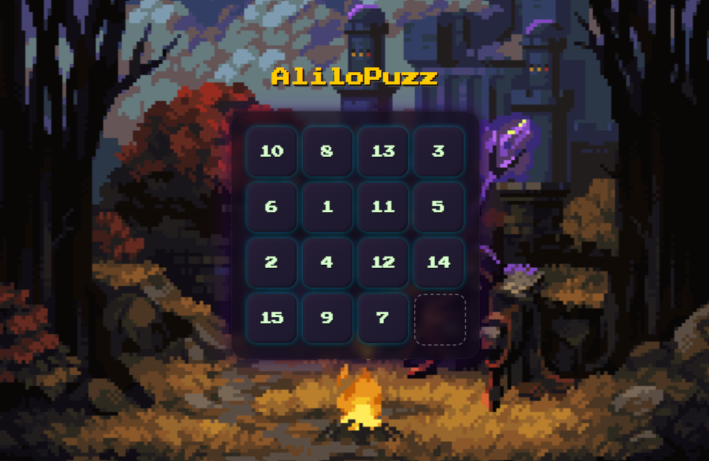

# 🧩 Sliding Puzzle Game

A classic sliding puzzle built with **HTML**, **CSS**, and **JavaScript** — featuring animated tiles, a clean wooden theme, and victory detection logic.

> Move the numbered tiles to arrange them in order. One tile space is empty — use it to slide the others!

---

## 📸 Preview

---
## YOU CAN PLAY IT ON : [alilopuzz.netlify.app](https://alilopuzz.netlify.app/)
---
## ✨ Features

- ✅ Dynamic grid size (choose 3x3, 4x4, 5x5…)
- ✅ Beautiful **wooden board style**
- ✅ **Tile slide animations**
- ✅ Win detection with celebration effect
- ✅ Fully responsive and keyboard-free

---

## 🚀 How to Run

Just open the `index.html` in your browser — no installation needed!

---

## 🛠 Tech Stack

- **HTML5** – structure and layout
- **CSS3** – grid display, animations, theme
- **JavaScript** – logic, interactivity, win detection

---

